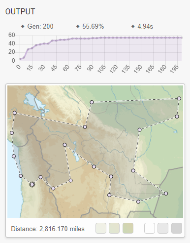

## Overview

BlazorAI is a web app developed in [Blazor](https://dotnet.microsoft.com/apps/aspnet/web-apps/blazor) to explore the use of [Genetic Algorithms](https://en.wikipedia.org/wiki/Genetic_algorithm) for solving problems.

The live version of the site can be viewed at [www.blazor.ai](https://www.blazor.ai/).

The Genetic Algorithm library used for evolving solutions is [GeneticSharp](https://github.com/giacomelli/GeneticSharp) by [Diego Giacomelli](https://github.com/giacomelli).

The Blazor component library used is [Blazorise](https://blazorise.com/) by [Mladen Macanovic](https://github.com/stsrki).

This project was inspired by [Tensorflow Playground](https://playground.tensorflow.org/).

## Problems

These are the problems that have been implemented so far:

### Travelling Salesman
* [Description](https://en.wikipedia.org/wiki/Travelling_salesman_problem)
* [Demo](https://www.blazor.ai/travellingsalesman)
* [Solver code](BlazorAI.Shared/Solvers/TravellingSalesmanSolver.cs)

 

### Five Houses / Einstein's Riddle / Zebra Puzzle
* [Description](https://en.wikipedia.org/wiki/Zebra_Puzzle)

### Eight Queens problem
* [Description](https://en.wikipedia.org/wiki/Eight_queens_puzzle)

### Password problem

